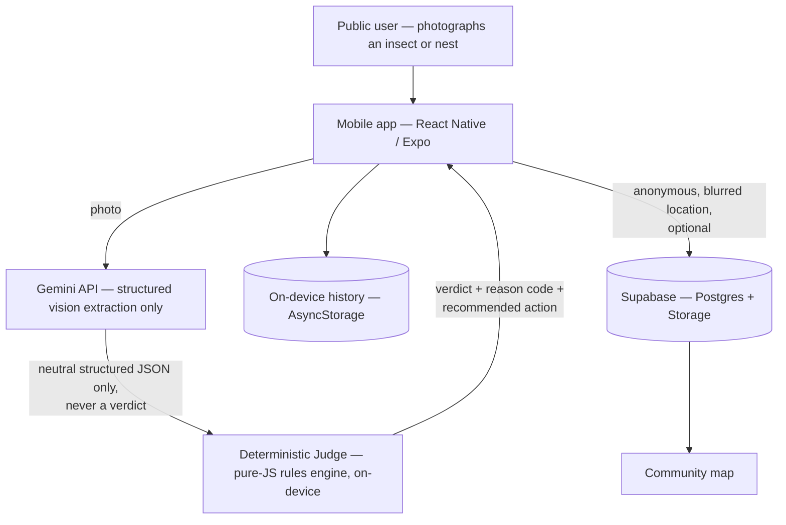
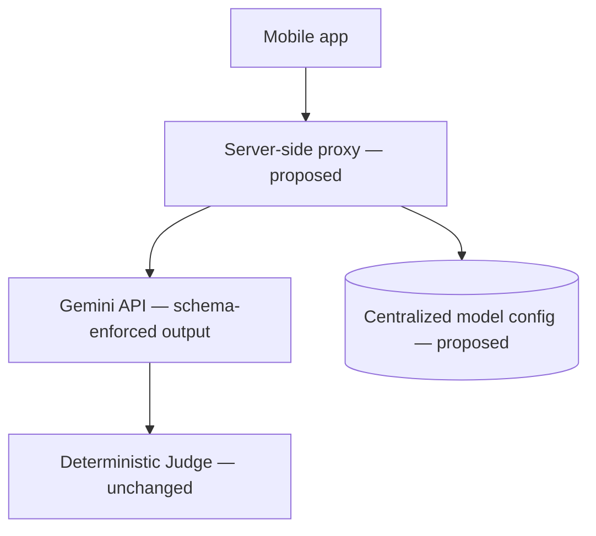

# ApiSave — Case Study & Architecture Overview (draft for sales team)

**Status: draft, needs client-facing confirmation before it leaves the building — see "Before this goes to a prospect" at the bottom.**

Same format as the SafeIQ write-up: case-study snapshot, architecture overview (with a diagram), capabilities, typical flows, integrations, and roles.

## Case study snapshot

| | |
|---|---|
| **Client** | [confirm exact company/trading name and whether it can be named at all before this is used externally — see note below] |
| **Industry** | Environmental safety / invasive-species biosecurity — Asian hornet (*Vespa velutina*) public detection and reporting *(the app's verdict taxonomy, nest-structure detection, and public-reporting/map flow are all built specifically around this use case; France/EU biosecurity context)* |
| **Project / Use case** | A mobile app that lets any member of the public photograph a suspected hornet or nest and get an immediate, explainable safety verdict. A vision model produces a neutral, structured description of what's visible only — it never decides the outcome. A separate, deterministic rules engine reads that description and computes the final verdict (confirmed target, probable nest, look-alike non-target species, insufficient data — retake, or clear), each with a specific, auditable reason code and recommended action. Verdicts can be shared anonymously (blurred location) to a community map. |
| **Technologies (current build)** | React Native + Expo (SDK 54), React 19, Hermes engine, New Architecture; Google Gemini API for vision-only structured extraction; a pure-JavaScript deterministic decision engine (no ML in the verdict path); Supabase (PostgreSQL + Storage) for anonymous community reporting; on-device AsyncStorage for local history and offline queueing; EAS for build/submit |
| **Technologies (proposed, not yet built)** | Server-side proxy enforcing structured-output schema validation on the model call; centralized, server-managed model configuration (so the vision model can be upgraded/rotated without an app release); a formalized multi-run/consensus check for borderline cases |
| **Logo** | Not available yet — needs to be requested from the client directly; nothing fabricated here. |

## Status note — read before using this externally

This project is at different levels of maturity depending on the layer, and the sales material should be honest about that rather than presenting it as one finished system:

- **Live and validated today:** the two-stage pipeline (vision extraction → deterministic Judge) is implemented and has been through several rounds of client-supplied real-world image validation, with a documented before/after regression set. Local history, offline queueing, and the onboarding/consent flow all run against the real device today.
- **Live, degrades gracefully if unconfigured:** the community-reporting layer (Supabase-backed anonymous report upload + public map) is real infrastructure, not a mock — but it's an optional feature by design, so the app functions fully offline/without it configured.
- **Proposed, not yet built:** server-side structured-output enforcement and centralized model configuration are agreed-upon future scope, not shipped. Don't present these as live.
- **In active refinement:** verdict stability on borderline/edge-case photos (distant subjects, unusual lighting) is an ongoing, evidence-driven tuning process — real client field-test photos are used as the regression set for every change, with before/after decision traces kept for each fix. This is a genuine strength to highlight (a rules engine you can audit line by line, not a black box) rather than something to gloss over.

## Architecture overview

### What's built today

The vision model is deliberately kept out of the decision: it only ever returns a neutral, structured description of what's visible (thorax colour, abdomen pattern, morphology, structural markers) — the verdict itself is always computed by a separate, deterministic, pure-JavaScript engine that runs on-device and is fully unit-testable without calling any AI at all. That separation is the core architectural decision of the whole product, and it's what makes every verdict auditable: for any result, you can show exactly which rule fired and why, rather than asking an AI model to explain itself after the fact. Community reporting is additive — the app is fully functional with it unconfigured.

### Proposed next layer (agreed scope, not yet built)

A thin server-side proxy would enforce a strict output schema on every vision call (removing an entire class of malformed-response risk) and let the model/version be swapped centrally without shipping a new app build. The Judge itself doesn't change — the audit-friendly separation between "the AI describes, the code decides" is the one architectural principle that carries through both today's build and the proposed next layer.

## Main capabilities

| Area | What it does |
|---|---|
| Photo-based identification | Point the camera at an insect or nest; get a verdict in seconds, grounded only in what's actually visible in the photo |
| Explainable verdicts | Every result carries a specific reason code and a plain-language justification — never a bare "yes/no" |
| Verdict taxonomy | Confirmed target, probable nest structure, look-alike non-target species (with a dedicated route so common look-alikes like the European hornet or Polistes wasps aren't mistaken for the target), insufficient data (asks for a retake, with a specific reason), or clear |
| Look-alike protection | Purpose-built rules distinguish the target species from close look-alikes using multiple independent visual signals, not a single trait |
| Community reporting & map | Verdicts can be shared anonymously, with the location deliberately blurred, to a shared map other users can see |
| History & offline support | Every analysis is saved locally; photos taken offline are queued and analysed automatically once connectivity returns |
| Onboarding & consent | First-run onboarding and a legal/consent gate before the app is usable |

## Typical flows

**Photograph and get a verdict**
A user photographs an insect or a structure. The app sends the photo to the vision model with a strict instruction to describe only what's visible — never to conclude anything. The deterministic Judge reads that structured description and independently computes the verdict, reason code, and recommended action, entirely without asking the AI to make the call itself.

**Share to the community map**
After a verdict, a user can choose to share it anonymously — the app deliberately blurs the exact location before it's ever sent — to a shared map so nearby users can see recent activity in their area.

**Offline capture**
A user without a connection can still take a photo; it's queued locally and analysed automatically the next time the app is online, with the result then folded into their history.

## Integrations

| Service | Used for |
|---|---|
| Google Gemini API | Structured, neutral visual description of the photographed subject — never the final verdict |
| Supabase (PostgreSQL + Storage) | Anonymous community report storage and the public map feed; optional — the app degrades gracefully if it isn't configured |
| Expo / EAS | Cross-platform build and submission pipeline (Android and iOS) |
| On-device storage | Local history, offline analysis queueing |

## Roles at a glance

- **Public user** — the only role today: photographs subjects, sees their own history, optionally shares to the community map
- **(Not yet built)** — any authority-facing or administrative dashboard is out of current scope; this is a public safety utility app, not a multi-tenant enterprise product, and shouldn't be pitched as one without new agreed scope

---

## Before this goes to a prospect

1. **Confirm the real client/company name and whether it can be named at all.** The engagement contact is not necessarily the entity whose name can be used in external sales material — confirm explicitly before naming anyone.
2. **Confirm whether the industry/use-case framing above can be shared externally.** It's drawn directly from the product's own domain logic (verdict taxonomy, nest-structure rules), not from anything the client told us was public.
3. **Get an actual logo from the client**, with permission to use it — none exists in this repo.
4. **Be clear in the deck about what's validated vs proposed vs in-progress**, per the status note above. In particular, don't present the model-configuration/schema-enforcement layer as shipped, and be upfront that borderline-case stability is an active, evidenced tuning process rather than a solved problem — that honesty is a credibility asset with a technical prospect, not a weakness to hide.
